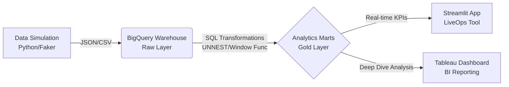

# Zombie Protocol: Mobile Game Analytics System


## Executive Summary
**Zombie Protocol Analytics** là một dự án **End-to-End Data Analytics** mô phỏng quy trình vận hành dữ liệu thực tế tại một Game Studio (FPS Genre), tương tự môi trường tại MPS Studio/VNG.

Dự án được thiết kế để giải quyết các bài toán cốt lõi của **LiveOps** (Vận hành game) thông qua dữ liệu:
1.  **Retention Mastery:** Phân tích tỷ lệ giữ chân người dùng theo Cohort để đánh giá chất lượng sản phẩm (Product-Market Fit).
2.  **Game Economy:** Kiểm soát lạm phát tài nguyên (Source vs. Sink) nhằm tối ưu hóa vòng đời kiếm tiền (Monetization).
3.  **Difficulty Balancing:** Phát hiện "Pinch Points" (Điểm nghẽn độ khó) gây Churn người dùng thông qua phân tích phễu (Funnel Analysis).

---

## Architecture & Tech Stack

Hệ thống được thiết kế theo luồng dữ liệu chuẩn doanh nghiệp (ELT Pipeline):



### Technologies Used

| Công nghệ | Mô tả & Ứng dụng |
| --- | --- |
| **Data Generation (Python)** | Sử dụng `Faker` & `NumPy` để mô phỏng hành vi người chơi phức tạp (User Segmentation: Whales vs. F2P). |
| **Google BigQuery** | Xử lý dữ liệu lớn với cấu trúc **Nested/Repeated Fields**, sử dụng `UNNEST`, `Window Functions` để tính toán KPI. |
| **Streamlit** | Xây dựng Interactive Dashboard cho team vận hành (Game Ops) theo dõi sức khỏe server realtime. |
| **Tableau** | Trực quan hóa chuyên sâu (Heatmap, Funnel) để tìm ra insight về hành vi người dùng. |

---

## Project Structure

```text
zombie-game-analytics/
├── data/                       # Generated CSV/JSON files (Local Storage)
├── data_generator/             # Python Simulation Engine
│   └── generate_data.py        # Script mô phỏng hành vi & sinh log
├── sql_queries/                # BigQuery Transformation Logic
│   ├── 01_cleaning.sql         # ETL: Flattening Nested JSON data
│   ├── 02_retention.sql        # KPI: Cohort Analysis & Retention Matrix
│   └── 03_economy_balance.sql  # KPI: Source vs. Sink Inflation Check
├── streamlit_app/              # Presentation Layer (LiveOps App)
│   └── app.py                  # Mã nguồn Dashboard điều hành
├── tableau_dashboards/         # BI Layer
│   └── Zombie_Performance.twbx # Tableau Packaged Workbook
├── requirements.txt            # Python dependencies
└── README.md                   # Project Documentation

```

---

## Key Features

* **Economy Balance Monitoring:** Theo dõi `Net Flow` và `Wallet Balance` theo thời gian thực để phát hiện lạm phát hoặc thiểu phát trong nền kinh tế game.
* **Cohort Retention Analysis:** Tính toán Retention Rate (D1, D7, D30) sử dụng kỹ thuật SQL `Self-Join` và `DATE_DIFF`.
* **Funnel Analysis & Anomaly Detection:** Tự động phát hiện các Level có tỷ lệ thắng (Win Rate) < 30% ("Pinch Points") gây ức chế cho người chơi.

---

## Installation & Setup

**1. Clone Repository**

```bash
git clone [https://github.com/trungkienthai2711/zombie-protocol-analytics.git](https://github.com/trungkienthai2711/zombie-protocol-analytics.git)
cd zombie-protocol-analytics

```

**2. Install Dependencies**

```bash
pip install -r requirements.txt

```

**3. Generate Simulation Data**
Sinh dữ liệu giả lập (Output: `data/game_data.csv` & `data/raw_logs.json`):

```bash
python data_generator/generate_data.py

```

**4. Launch Analytics Dashboard**
Khởi động Web App điều hành:

```bash
streamlit run streamlit_app/app.py

```

---

## SQL Logic Showcase

Điểm mạnh của dự án là khả năng xử lý dữ liệu **Nested JSON** đặc thù của Google Analytics 4/Firebase:

```sql
/* Extract Level & Revenue from Nested Event Params */
SELECT 
  PARSE_DATE('%Y%m%d', event_date) AS date,
  event_name,
  -- Kỹ thuật UNNEST để lấy giá trị từ mảng lồng nhau
  (SELECT value.int_value FROM UNNEST(event_params) WHERE key = 'level') AS level,
  (SELECT value.double_value FROM UNNEST(event_params) WHERE key = 'value') AS revenue
FROM `project.dataset.raw_events`
WHERE event_date >= '20250101';

```

---

## Screenshots

### Streamlit LiveOps Dashboard


---

## Author

**THÁI TRUNG KIÊN (RABBIT)**

* **Role:** Data Analyst / Analytics Engineer
* **Focus:** Game Analytics, Business Intelligence, Data Modeling.
* **Contact:** [kienthai2711@gmail.com](mailto:kienthai2711@gmail.com)
* **LinkedIn:** [linkedin.com/in/trungkienthai2711](https://www.linkedin.com/in/trungkienthai2711/)

> *"Data is not just numbers; it's the voice of the players."*

---

*Disclaimer: This is a portfolio project using synthetic data generated by Python scripts. It demonstrates technical capabilities relevant to the Game Analytics domain.*
